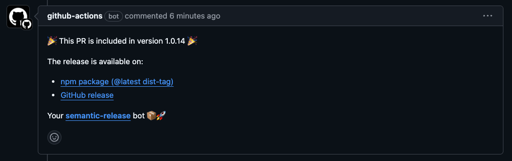
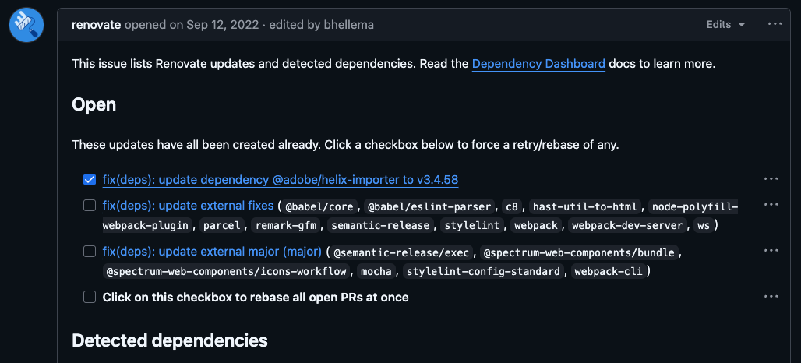

# Releasing

After merging a PR into `main`, a build will run and perform a release automatically. For example, the 1.0.14 build was done
[here](https://github.com/adobe/helix-md2jcr/commit/36604f967d4c694daa5a05f020b87f387ac46040) for PR [57](https://github.com/adobe/helix-md2jcr/pull/57). 
Once the `main` build is successful, the PR is updated with the release information.

### Updating Project Dependencies

#### Helix-Importer

To move the release to the next stage, update the projects that require the new version. For example, the
[helix-importer](https://github.com/adobe/helix-importer). Navigate to the [Dependency Dashboard](https://github.com/adobe/helix-importer/issues/6) 
and click the checkbox to get Renovate to run again.

Once the Renovate bot has completed its execution, a new PR will be opened with the updated version. For example, the 
PR [here](https://github.com/adobe/helix-importer/pull/492) updates the helix-importer to use the new version of helix-md2jcr. Squash and 
merge the PR to complete the release process into the helix-importer project.

Wait until the `main` branch has been updated with the new version before moving on to the next project and note the release version. 
For example, the helix-importer project was updated to version [1.0.14](https://github.com/adobe/helix-importer/commit/9a1ba65bc5a4507f214027e6ce076af86cb04567) 
and released with version 3.4.58.

The next step is to update the [helix-importer-ui](https://github.com/adobe/helix-importer-ui) project to use the new version of helix-importer.

#### Helix Importer UI Update

Navigate to the [Dependency Dashboard](https://github.com/adobe/helix-importer-ui/issues/19) and click the checkbox to get Renovate to run again. 
Review the PRs and select the PR for the helix-importer version update.

You may see the following dialog which requires your attention to select the checkbox with the updated version.
 

Once selected, a new PR will be opened.

For example, the PR [here](https://github.com/adobe/helix-importer-ui/pull/470) updates the helix-importer-ui to use the new version of 
helix-importer. Wait for the build to complete and merge the PR to complete the release process into the helix-importer-ui project.

If you wish to test the changes locally, you can follow the development setup [document](development.md). Once you are satisfied with the changes, 
merge the PR.

Once the changes have been merged to `main`, they are now available for use in the Helix Importer UI for the world to use.
